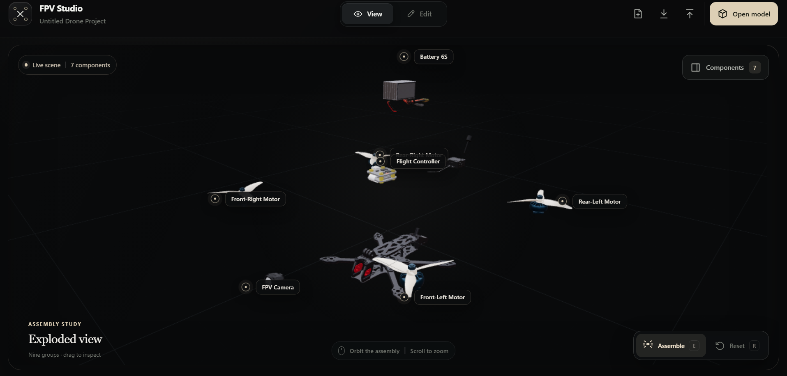
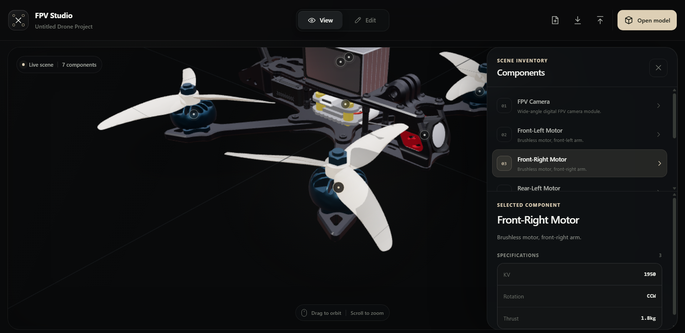
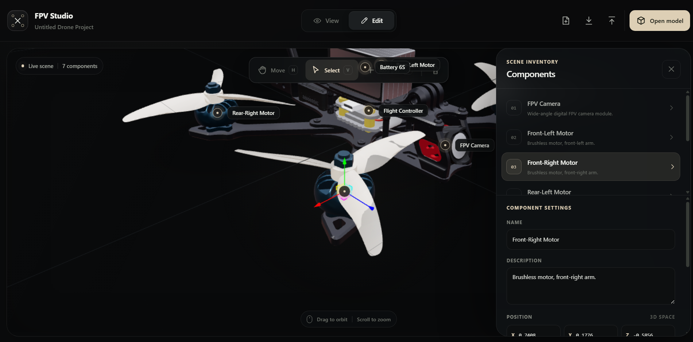

# FPV Studio

Visualiseur 3D interactif de drone FPV. Placez des points sur les composants, documentez leurs caractéristiques et explorez le modèle dans une interface responsive.

## Fonctionnalités

- **Visualisation 3D** : navigation orbitale, zoom et mise au point animée sur le composant sélectionné
- **Inspecteur contextuel** : description et caractéristiques techniques réelles, sans données simulées
- **Mode View** : consultation claire du modèle et de son inventaire
- **Mode Edit** : ajout, déplacement et suppression de points directement sur le modèle
- **Édition complète** : nom, description, coordonnées et liste de caractéristiques personnalisables
- **Raccourcis clavier** : `V` pour sélectionner, `A` pour ajouter, `H` pour naviguer, `Suppr` pour supprimer
- **Responsive** : panneau latéral sur ordinateur et feuille contextuelle sur mobile
- **Sauvegarde automatique** : projet conservé dans le navigateur
- **Import / Export** : projet transportable au format JSON
- **Chargement progressif** : l’interface est affichée avant le moteur 3D
- **Vue éclatée** : animation des neuf sous-ensembles 3D réels du drone
- **Rendu optimisé** : modèle Meshopt allégé et scène recalculée uniquement pendant les interactions

## Utilisation

1. Ouvrez un modèle `.glb` ou `.gltf` avec **Open model**.
2. Passez en mode **Edit**.
3. Choisissez **Add pin**, puis cliquez sur le modèle.
4. Renseignez les informations du composant dans l’inspecteur.
5. Revenez en mode **View** pour parcourir la scène.
6. Utilisez **Export** pour conserver une copie du projet.

## Aperçu








## Raccourcis

| Touche | Action |
| --- | --- |
| `V` | Outil de sélection |
| `A` | Ajout d’un point |
| `H` | Navigation dans la scène |
| `E` | Éclater ou réassembler le drone |
| `R` | Réinitialiser la caméra |
| `Suppr` | Suppression du composant sélectionné |
| `Ctrl/Cmd + C` | Copier un composant |
| `Ctrl/Cmd + V` | Coller un composant |
| `Échap` | Désélectionner |

Les raccourcis de modification sont actifs uniquement en mode **Edit** afin d’éviter les suppressions accidentelles pendant la consultation.

## Performances

Le modèle FPV optimisé pèse environ 2,25 Mio au lieu de 29 Mio et passe d’environ 905 000 à 265 000 triangles. Le DPR est limité à 1, les matériaux identiques sont mutualisés, les matrices statiques ne sont plus recalculées et les repères HTML sont retirés pendant la rotation. Les ombres coûteuses ont été supprimées et le canvas 3D reste au repos tant qu’aucune interaction ou animation n’est active.

## Démarrage

```bash
npm install
npm run dev
```

## Production

```bash
npm run build
npm run preview
```

Stack : React, Vite, Three.js, React Three Fiber et Drei.
