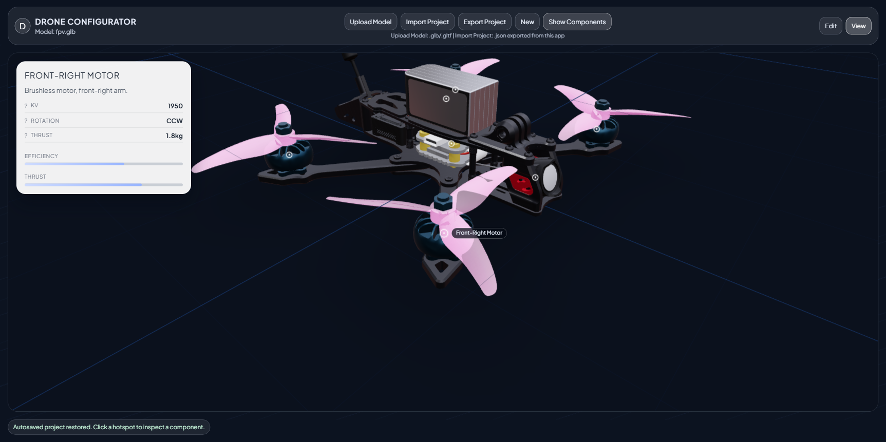
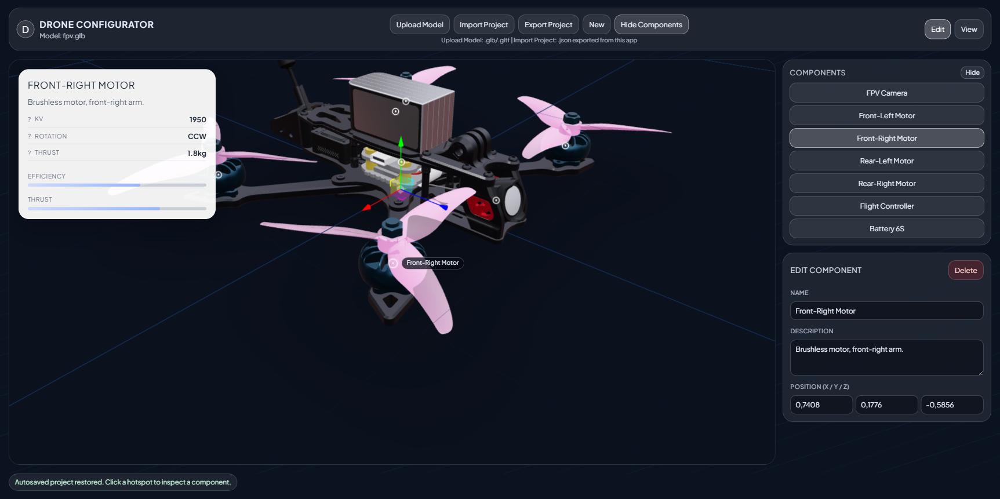

# FPV Viewer

FPV Viewer permet de presenter un drone en 3D, d'ajouter des points interactifs sur les composants, puis d'afficher des fiches d'informations claires au clic.

## Apercu






## Ce Que Vous Pouvez Faire

- Charger un modele drone en `.glb` ou `.gltf`
- Basculer entre `Edit` et `View`
- Ajouter des points sur les composants du modele
- Deplacer un point en 3D pour un placement precis
- Renseigner nom, description et specs de chaque composant
- Ouvrir une fiche composant blanche au clic
- Cliquer dans le vide pour deselectionner
- Afficher ou masquer le panneau `Components`
- Sauvegarder automatiquement le projet dans le navigateur
- Exporter et importer un projet complet en JSON

## Workflow Recommande

1. Chargez votre modele avec `Upload Model`.
2. Passez en `Edit` pour placer et ajuster les points.
3. Completez les informations des composants.
4. Passez en `View` pour tester l experience utilisateur finale.
5. Exportez le projet avec `Export Project`.

## Upload / Import / Export

- `Upload Model`: charge le fichier 3D (`.glb` / `.gltf`)
- `Import Project`: recharge un projet JSON exporte depuis l app
- `Export Project`: telecharge le projet courant (points + metadata)

Si un projet importe reference un modele non charge, les donnees sont conservees et l app vous demandera de re-uploader le modele correspondant.

## Demarrage Rapide

```bash
npm install
npm run dev
```

## Note Technique 

Stack: React + Vite + Three.js (React Three Fiber / Drei). Les donnees projet sont stockees localement dans le navigateur et transportables via JSON.
